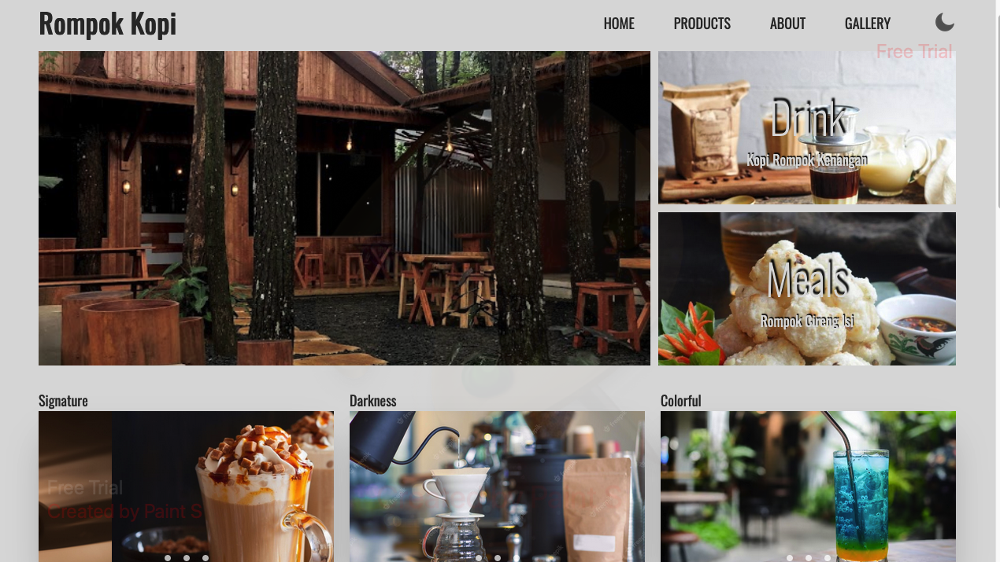

<h1>RevoU Week 3 Assignment</h1>

improves something that you have created last week with advanced HTML and CSS technique

<h2>Table of Contents</h2>
<ol>
<li>HTML Structure</li>
<li>Style CSS</li>
<li>Javascript</li>
<li>Readme File</li>
<li>Assets</li>

<h2>Assignment Information</h2>

1. I reworked my last week assignment to make it looks more modern with similar concept of warframe website as reference.
2. Google font is used in this project, with Oswald.
3. Text shadow are applied for text on top of images to make it more clearer.
4. News section are made using Asymmetrical Grid
5. Day and Night mode is made by hiding checkbox and adding bunch of transition magic to make it FEEL like sliding buttons.
6. Carousel is added at the bottom of News section, purely from css. I beg thee not to explain it in-depth because I made it at the dawn of night half-asleep.
7. Media query are optimized for 1440px, with small adjustment at 1024px and 768px. !important is used for screen above 600px to fix Mobile's burger menu sometimes hides navbar when transitioned to larger screen size.

## Sign-up to Netlify

1. Go to netlify.com

2. Click Log-in

3. Log-in with GitHub
   
   

## Deploy on Netlify from GitHub

1. Go to Site, click Add new site, Import an existing project
   
   

2. Click deploy with GitHub, and wait for authorizing 
   
   

3. Choose the repository
   
   
   
   

4. Scroll down, Deploy Site
   
   ## Auto Deploy
   
   Once you deploy the site, it will be automatically deployed when you push somethings to your GitHub repository.
   
   ## Domain Purchase
   
   1. Go to domain seller websites (n this case I'm using Niagahoster) Click domain, cari & cek domain.
      
      
      
      
   
   2. Type your site name, make sure your site name is available, and click Cek Sekarang.
      
      
   
   3. Choose your domain (in this case I'm using .site) choose your payment option and follow the instruction for your payment method.
      
      
   
   4. After making a payment then fill in your personal data then your domain is active and can be used.
      
      ## Setting up Cloudflare
      
      1. Go to "dash.cloudflare.com", click Sign up, follow the instruction and confirm your email.
      
      2. Login using the account you just made.
      
      3. Click "Add a site" button on the right-side of the web page.
      
      4. Enter your site name, click Add site.
      
      5. Scroll down and click Free, then Continue.
      
      6. Copy Nameserver 1 & 2, later you'll need this to overwrite your domain Nameserver.
         
         
      
      7. Go to your domain provider, click Domains -> your Domain Name.
      
      8. click Nameservers, and paste Nameservers provided by Cloudflare.
         
         
         
         ## Setting DNS
         
         1. go to your cloudflare account, click your website name -> DNS -> Records, click Add record.
            
            
         
         2. Enter "Type: CNAME, Name: @, IPv4 address: your Netlify.app link.
         
         3. Enter "Type: CNAME, Name: www, IPv4 address: your Domain name.
            
            ## Connecting Domain to Netlify
            
            1. Login to your Netlify account, then click your deployed website.
            
            2. go to Site overview -> Domain settings
            
            
         
         4. Click Add domain alias, type your domain name, verify click Add domain.
            
            
         
         5. Wait for awhile and your site is ready to be used.

<h2>Deploy Link</h2>
<link>https://mnajmytsss.site"</link>
  
